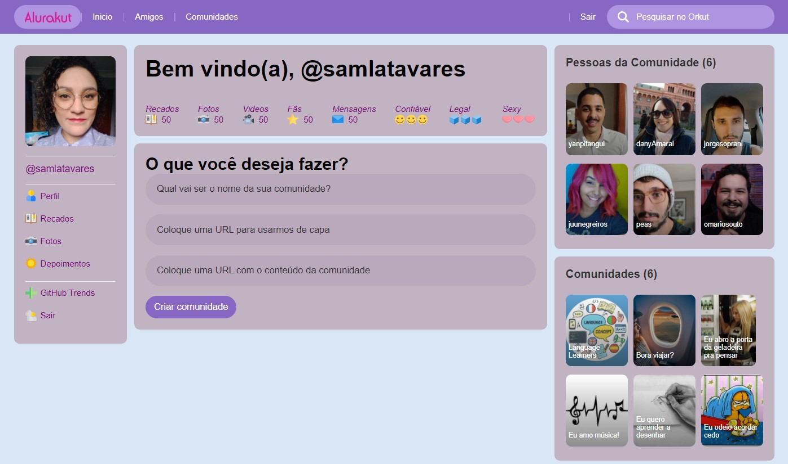

# aluraKut

	English | <a href="https://github.com/samlatavares/aluraKut/blob/main/translations/pt-br/README.md">Português</a>

</img>

</img>

## Used Technologies
- React.js
- Next.js
- Yarn
- Vercel
- API consume
- DatoCMS

## What is this project?
- This project was made during 2021 Alura's React Immersion and is the Alura version of Orkut.
- The instructors from Alura made the initial project available during the Immersion and every participant should change the code, adding functionalities and also customizing the style.

## Working with this project
- In order to work with this project, you can clone this repository.
	- git clone https://github.com/samlatavares/aluraKut
- To open the project, you can use a tool like <a href="https://code.visualstudio.com/download" target="_blank">Visual Studio Code</a>.
- You also have to install <a href="https://nextjs.org/docs" target="_blank">next.js</a> and <a href="https://yarnpkg.com/getting-started" target="_blank">yarn</a> in your local machine. You can check the configured commands at the package.json file.
- You can check the application's local url at the launch.json file.

## How to use the application?
- You can access the application <a href="https://alurakut-olive-delta.vercel.app/login" target="_blank">here</a>.
- It'll open a page where you can fill the field "Usuário" with your Github's username.
- The application will show a page that is very similar to the old social network Orkut by Google.
- You can check your Github followers, your photo and create and see Communities.
	
## Thank you!
- Thank you to see this repository. It was made during my studies and I'm not going to do enhacements here.